### 1.SQLITE数据库表设计

#### 1.1ER图

​		系统的ER图如图下所示，其中包含实体、关系和属性。两个实体之间的关系是一对多的关系，即一个分组能包含多个待办事件，一个待办事件只能属于一个分组，因此在建立表时需要在待办事件表中添加一列分组id，用来区分待办事件所属的分组。另外为了方便区分我的待办事件，将我的待办分组id设置为-1。

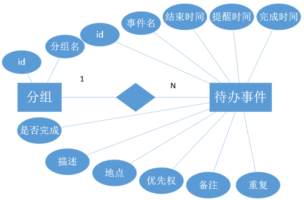

#### 1.2 数据库表结构

- 分组表（groups）

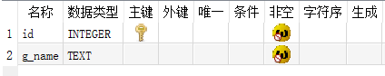

- 待办表（todo）

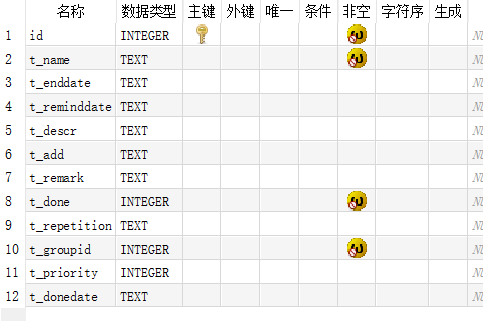

### 2.功能简介

#### 2.1 我的首页

- 新建待办：在新建待办输入框中输入待办事件名，回车后自动创建待办事件。

- 刷新：将我的首页界面刷新到初始化状态

- 分类显示待办事件：

  - 未安排：显示没有设置待办结束时间的待办事件

  - 未来七天：显示待办结束时间在七天内的事件
  - 以后：显示待办结束事件超过七天的事件

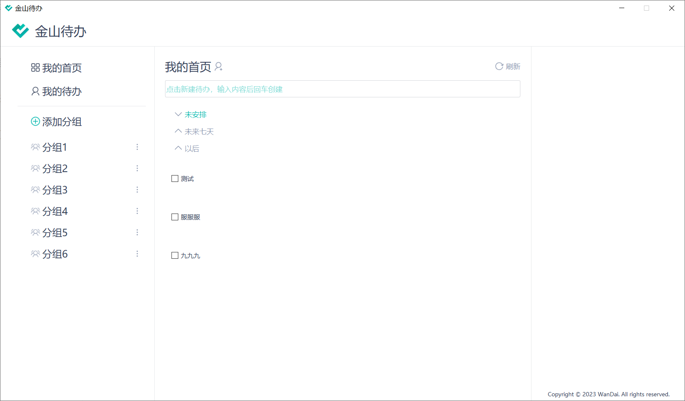

#### 2.2我的待办

- 新建待办：在新建待办输入框中输入待办事件名，回车后自动创建待办事件。
- 待办编辑：点击未完成或者已完成待办事件右侧会出现待办事件编辑窗口
- 完成待办：勾选未完成待办事件左上角的选项框，待办事件完成，如果下方已完成待办事件窗口展开，勾选会立即显示在下方。
- 隐藏显示已完成待办事件：点击后会隐藏和显示已完成的待办事件

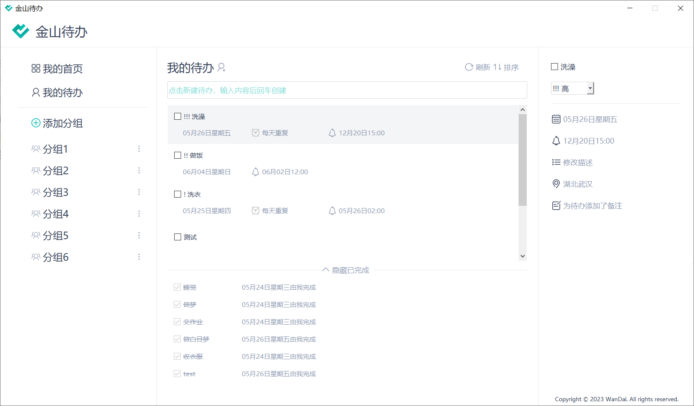

#### 2.3分组功能

- 新建分组：点击新建分组按钮会弹出会话框，输入分组名回车或者点击ok即可创建分组，同时分组列表刷新显示新的分组。

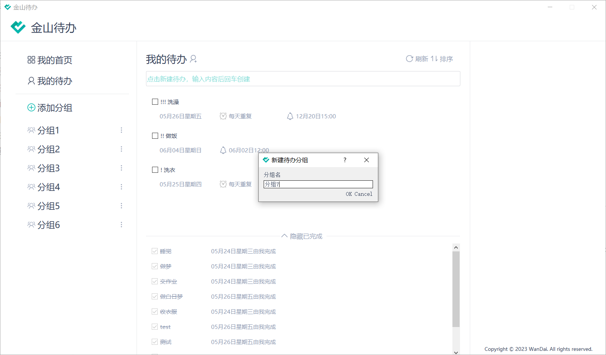

- 分组编辑功能：点击分组列表项的右侧展开编辑菜单，包括**重命名和删除**

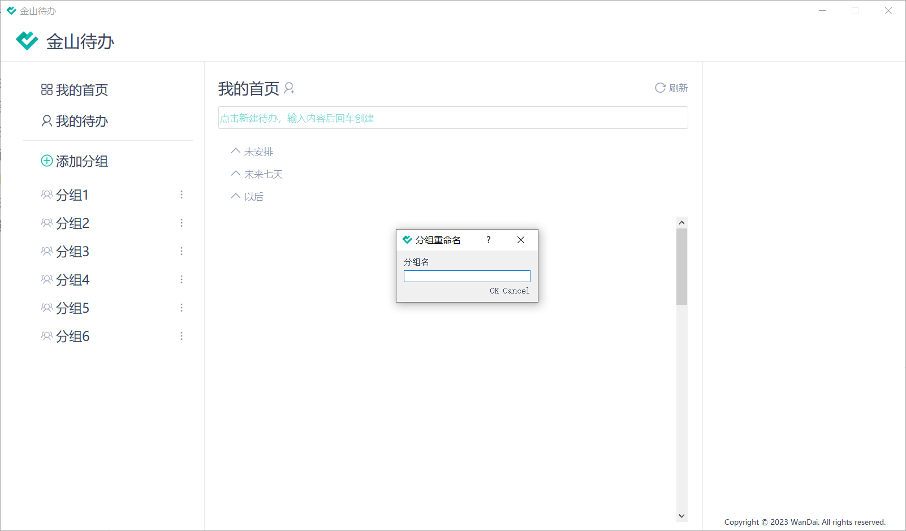

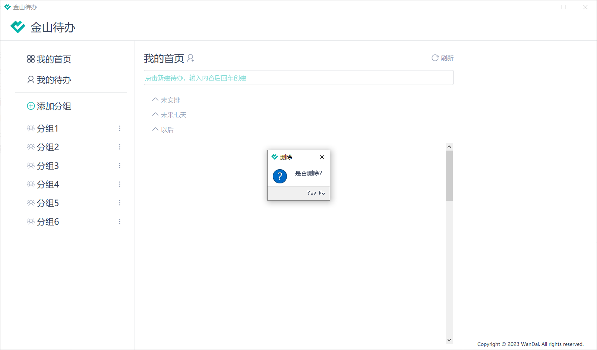

- 分组待办显示：点击分组，会显示分组的待办事件
- 分组待办事件创建：在当前分组下，输入框中输入待办事件名回车创建改分组下的待办事件
- 分组待办事件编辑、完成、排序和显示隐藏已完成待办事件与我的待办相同

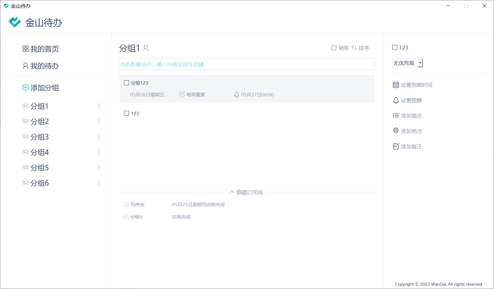

#### 2.4待办事件编辑

我的待办和分组内的待办都可以通过右侧遍历栏修改。

- 待办完成修改：通过勾选或者取消右侧编辑栏的选择框，可以实现待办事件的完成与取消完成。
- 待办优先权修改：通过右侧编辑栏的下拉窗口可以选择待办事件的优先权类别。

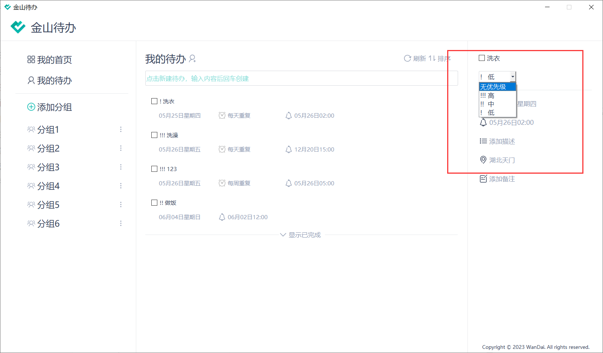

- 待办结束事件设置：选择日历表日期和设置重复下拉框，然后点击确定就能设置待办的到期时间和重复。

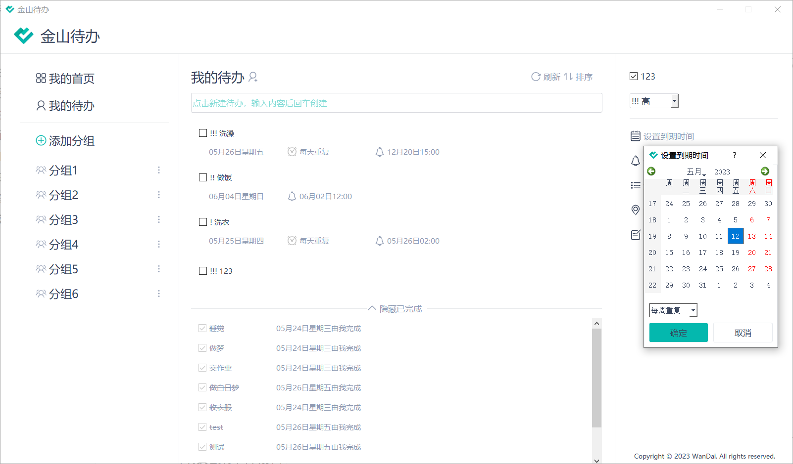

- 待办提醒时间设置：选择日历表日期和时间，点击确定就能设置提醒时间。

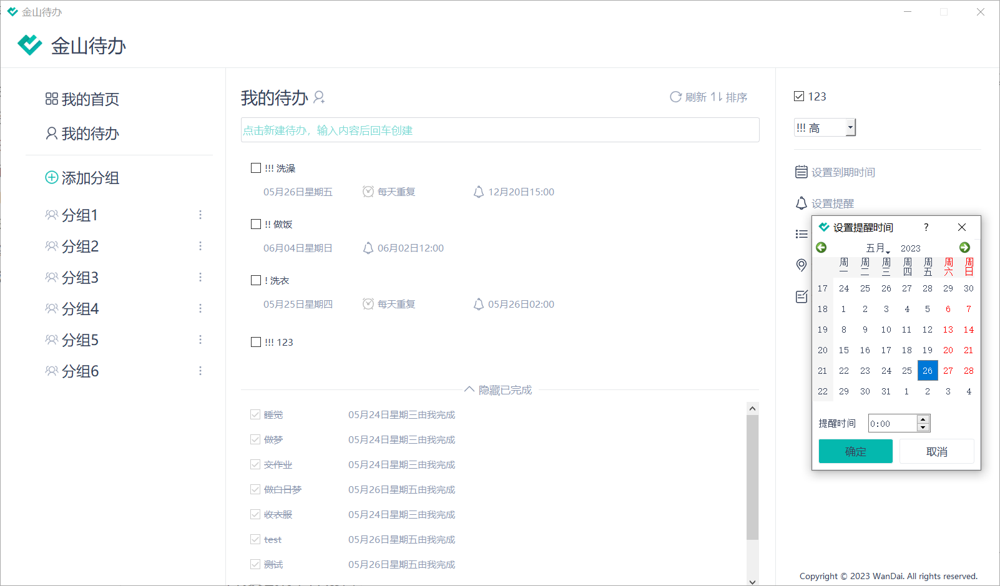

- 添加描述、添加地点、添加备注：点击后弹出输入对话框，输入文本内容，回车或者点击ok即可修改。

#### 2.4排序

我的待办和分组待办都可以通过排序菜单排序。

- 排序：点击排序按钮会弹出菜单栏，分别为到期时间、创建时间和优先级排序

  - 到期时间排序

  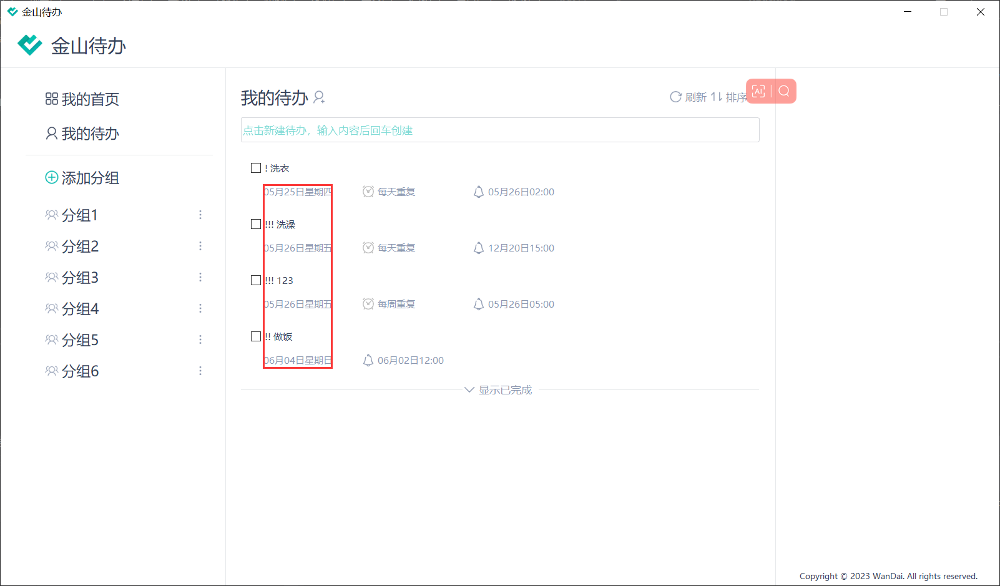

  - 创建时间排序：根据待办id排序，id为主键自增。
  - 优先级排序

  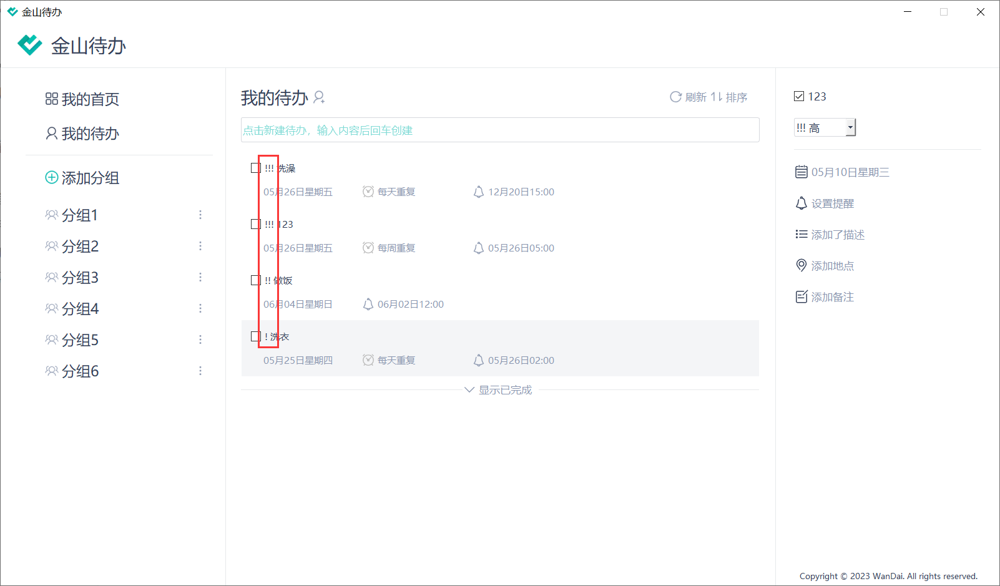

