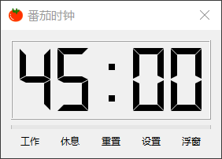
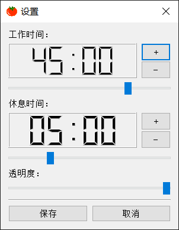
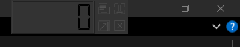
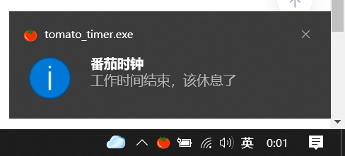

# 番茄时钟

## 平台
x86 windows平台
MinGw开发

## 界面
### 主界面

**工作**  开始工作倒计时

**休息**  开始休息倒计时

**重置**  重置当前状态的倒计时

**设置**  进入设置界面，调整倒计时的时间，调整悬浮窗口的透明度

**浮窗**  隐藏主窗口，显示悬浮窗

### 设置界面

设置界面

**工作时间**  工作时间倒计时

**休息时间**  休息时间倒计时

滑动条用于粗调时间，按钮可以微调

**透明度**  悬浮窗口的透明度设置，透明度调节时会实时显示在主窗口，但是主窗口上的透明度只是代替悬浮窗做调节时显示而已。

**保存**  本地会保存一份setting.ini文件，保存当前的设置

**取消**  不保存当前的配置，直接关闭窗口

### 浮窗

显示悬浮窗

悬浮窗上有四个按钮，鼠标悬浮可显示tooltip，查看该按钮的功能。

浮窗Widget中重写了鼠标的事件，包括鼠标移动，鼠标打击和双击。

双击悬浮窗，可以打开主窗口。

### 系统托盘
关闭主界面，自动打开系统托盘。系统托盘会发出倒计时结束的消息提醒，点击消息可打开主窗口。

### 消息提醒

倒计时结束，发出消息提醒。点击该消息可以打开主界面。

## 配置
配置参数使用 *QSetting* 类保存的 setting.ini 文件。
保存的内容是设置的时间，透明度，悬浮窗的上次的位置。

